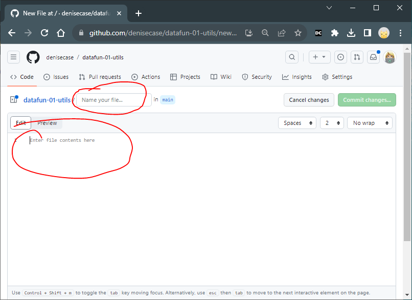
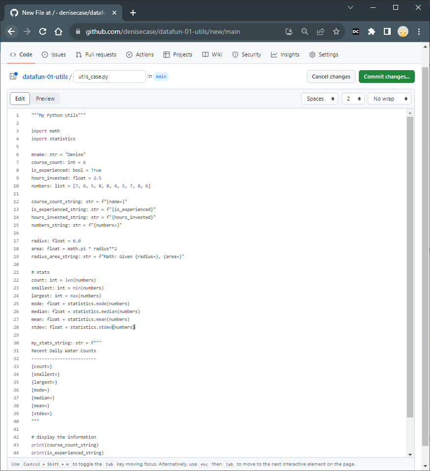

# GitHub: Add a File

## Why This Topic is Important

Sometimes you need to add a file to a repository. This is a common task.
We don't always need to bring the entire project down to our local machine.
It helps to know how to add a file directly to GitHub.

## Introduction

This assumes you have a GitHub account and have created a repository for your project.

## Steps

Click Add file / Create New

You'll see something like this.  You'll need to Name your file... and paste in the contents from your online IDE.

Name the file utils_yourname.py or whatever is appropriate or required for your project.

Copy and paste your code to complete the contents of the file.

After pasting, click "Commit changes", the green button. Provide a useful commit message.
The message should be describe the changes in present tense.
Click Commit changes.

You will be returned to the main repo page.
Click refresh to see the changes.

After refreshing the page, you'll see your project with the new file.

The file name is a hyperlink.
 Click it to view your project code, stored safely in the cloud and ready to share.

